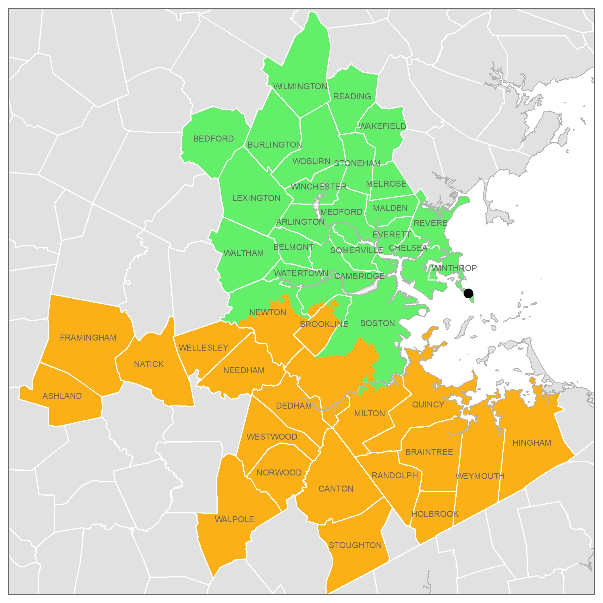
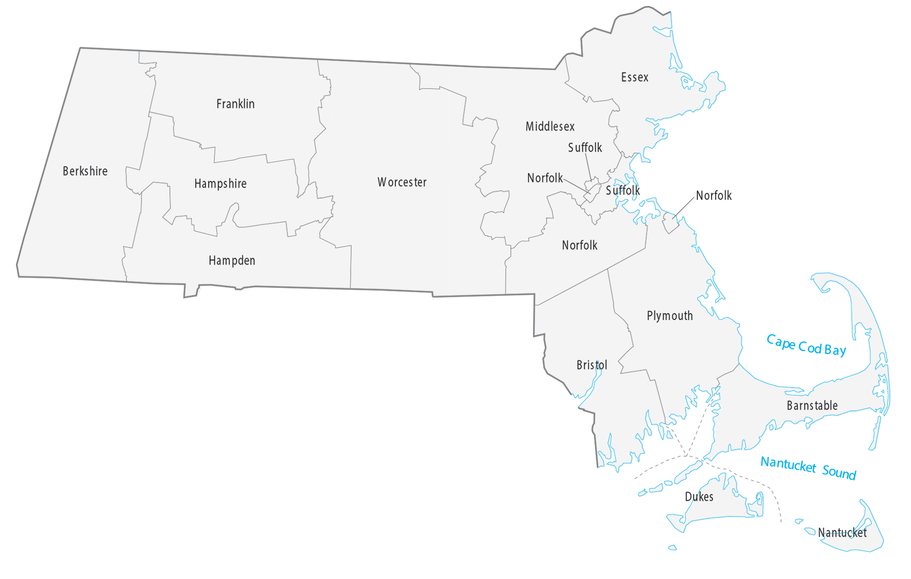

# Introduction

This is a summary of the public health data for the state of Massachusetts obtained from the Massachusetts Department of Public Health (MADPH) and the National Respiratory and Enteric Viruses Surveillance System (NREVSS). The MADPH data for both COVID-19 and Influenza looks quite exciting because we see a sharp increase in positive tests and positive test percentages within the Project Runway Coverage Period. Positive tests start to rise at the beginning of November for COVID-19 and at the end of November for Influenza. The data from NREVSS is not as useful because the testing levels are quite a bit lower (positive tests for Flu and COVID-19 reach a maximum of ~4250 and ~6000 respectively, while the most common NREVSS pathogen, Rhinovirus, caps out at ~130.)

We still need to decide if we want to create incidence estimates for all of these pathogens. But I already think it will be interesting to check if the sequencing data show an increase in pathogen abundance that matches the rate of increase in testing data.

# The Data

From MADPH, we have data on COVID-19 (positive tests and positive test percentage) and on Influenza (positive tests). The data ranges from July 2023 to the end of February 2024.

From NREVSS, we have data on Parainfluenza, Rhinovirus, Enteric Adenovirus, Respiratory Adenovirus, Metapneumovirus, and Seasonal Coronavirus. However, the data for Enteric Adenovirus, Seasonal Coronavirus, and Metapneumovirus is not usable. Enteric Adenovirus shows 0 positive tests across the entire sampling period, Metapneumovirus shows a maximum of 6 positive tests per week (~2% positive test percentage), and Seasonal Coronavirus only gives a maximum of 4 positive tests per week, with no information on the total number of tests performed.

:::{.column-body-outset}
| Pathogen | Source | Date Begin | Date End | Data Type |Spatial Resolution| Plotted |
|---|---|---------------|----------------|-----------------|--------------------|----|
| Human Parainfluenza  | [Gsheets](https://docs.google.com/spreadsheets/d/164pRmoySKWY9pkto-jhJo7w9sN51OPJq_gtkG3DuyaU/edit?usp=sharing) | 03-06-2023 | 30-12-2023  | PosTest + PosPerc | State | Yes |  |
| Enteric Adenovirus| [GSheets](https://docs.google.com/spreadsheets/d/164pRmoySKWY9pkto-jhJo7w9sN51OPJq_gtkG3DuyaU/edit?usp=sharing) | 03-06-2023 | 30-12-2023  | PosTest + PosPerc | State | No |  |
| Respiratory Adenovirus  | [GSheets](https://docs.google.com/spreadsheets/d/164pRmoySKWY9pkto-jhJo7w9sN51OPJq_gtkG3DuyaU/edit?usp=sharing) | 03-06-2023 | 30-12-2023  | PosTest + PosPerc | State | Yes |
| Human Metapneumovirus| [GSheets](https://docs.google.com/spreadsheets/d/164pRmoySKWY9pkto-jhJo7w9sN51OPJq_gtkG3DuyaU/edit?usp=sharing) | 03-06-2023 | 30-12-2023  | PosTest + PosPerc | State | No  |
| Seasonal Coronavirus | [GSheets](https://docs.google.com/spreadsheets/d/164pRmoySKWY9pkto-jhJo7w9sN51OPJq_gtkG3DuyaU/edit?usp=sharing) | 03-06-2023 | 30-12-2023  | PosTest + PosPerc | State | No |
| Rhinovirus  | [GSheets](https://docs.google.com/spreadsheets/d/164pRmoySKWY9pkto-jhJo7w9sN51OPJq_gtkG3DuyaU/edit?usp=sharing) | 03-06-2023 | 30-12-2023  | PosTest + PosPerc | State | Yes |
| COVID-19 | [Mass.gov](https://www.mass.gov/info-details/covid-19-reporting)| 02-07-2023 | 02-03-2024| PosTest + PosPerc | County | Yes  |
| Influenza| [Mass.gov](https://www.mass.gov/info-details/influenza-reporting)  | 02-07-2023 | 02-03-2024| PosTest | State | Yes |

:::

# MADPH
The COVID-19 data provided by MADPH has county-level, weekly resolution. This allows us to look at testing data matching the Deer Island catchment area.



This area approximately matches Suffolk county and overlaps with Norfolk, and Middlesex.


```{python}
import pandas as pd
import numpy as np
import matplotlib.pyplot as plt
import matplotlib.dates as mdates
from matplotlib.lines import Line2D
df_adeno = pd.read_csv('data/2024-02-27 NREVSS data request MA June-Dec 2023 - Respiratory Adenovirus.tsv', sep='\t')
df_parainfluenza = pd.read_csv('data/2024-02-27 NREVSS data request MA June-Dec 2023 - Human Parainfluenza.tsv', sep='\t')
df_rhino = pd.read_csv('data/2024-02-27 NREVSS data request MA June-Dec 2023 - Rhinovirus.tsv', sep='\t')
df_covid = pd.read_csv('data/covid-19-dashboard-03-07-24/County data-Table 1.tsv', sep='\t')
df_flu = pd.read_csv('data/flu-dashboard-data-03-07-24/Influenza Lab Tests Reported-Table 1.tsv', sep='\t')
```
## COVID-19

The plot below shows data both for the entire state and the counties covered by Deer Island (Suffolk, Norfolk, Middlesex). COVID-19 cases see a decrease until the beginning of November and a sharp increase and peak over the rest of the Project Runway coverage period.

```{python}
#| warning: false

fig, ax1 = plt.subplots(figsize=(8, 6))

df_counties = df_covid[df_covid['County'].isin(['Suffolk', 'Norfolk', 'Middlesex'])]
df_counties["date"] = pd.to_datetime(df_counties["Week Start Date"], format='%m/%d/%y')


df_counties["pos_agg"] = df_counties["Positive tests the week"].groupby(df_counties["date"]).transform('sum')
df_counties["percent_positive_agg"] = df_counties["pos_agg"] / df_counties.groupby("date")["Tests during the week"].transform('sum') * 100

ax1.set_xlabel('Months (2023-2024)')
ax1.set_ylabel('Positive Percentage')
ax1.plot(df_counties["date"], df_counties["percent_positive_agg"], color='tab:blue', linestyle='--', label='Counties (% Positive)')
ax1.tick_params(axis='y')

ax2 = ax1.twinx()
ax2.set_ylabel('Positive Tests per Week')
ax2.plot(df_counties["date"], df_counties["pos_agg"], color='tab:blue', linestyle='-', label='Counties (# Positive)')
ax2.tick_params(axis='y')

df_ma = df_covid[df_covid['County'] == 'Statewide (all of MA)']
df_ma["date"] = pd.to_datetime(df_ma["Week Start Date"], format='%m/%d/%y')
df_ma["Week percent positivity"] = df_ma["Week percent positivity"].astype(float)
df_ma["percent positive"] = df_ma["Week percent positivity"] * 100

ax1.plot(df_ma["date"], df_ma["percent positive"], color='tab:red', linestyle='--', label='MA (% Positive)')
ax2.plot(df_ma["date"], df_ma["Positive tests the week"], color='tab:red', linestyle='-', label='MA (# Positive)')

ax1.xaxis.set_major_locator(mdates.MonthLocator())
ax1.xaxis.set_major_formatter(mdates.DateFormatter('%b'))

ax1_yminlim, ax1_ymaxlim = ax1.get_ylim()
ax1.set_ylim(0, ax1_ymaxlim)

ax2_yminlim, ax2_ymaxlim = ax2.get_ylim()
ax2.set_ylim(0, ax2_ymaxlim)

ax1.axvspan(pd.to_datetime('2023-10-01'), pd.to_datetime('2023-12-31'), color='lightgrey', alpha=0.5)
ax1.text(pd.to_datetime('2023-11-15'), ax1_ymaxlim * 1.02, 'Project Runway Sampling', fontsize=12, ha='center')

for y in range(0, int(ax1_ymaxlim) + 1, 2):
    ax1.axhline(y, color='black', linestyle='-', lw=0.2)

ax2.tick_params(axis='y', right=False, left=False)


legend_elements = [Line2D([0], [0], color= 'black',  linestyle='-', label='Positive Tests'),
                   Line2D([0], [0], color= 'black', linestyle='--', label='Percentage Positivity'),
                   Line2D([0], [0], color= 'tab:red', linestyle='-', label='Massachusetts'),
                   Line2D([0], [0], color= 'tab:blue', linestyle='-', label='Suffolk, Norfolk, Middlesex')]


ax1.legend(handles=legend_elements, loc='upper left')

fig.tight_layout()
plt.show()
fig.clf()
```

## Influenza
We do not have Percentage Positivity data for Influenza. Still, based on the number of positive tests the Influenza season likely started during the PR coverage period.
```{python}
#| warning: false
df_flu['date'] = pd.to_datetime(df_flu['Week Start Date'], format='%m/%d/%y')
df_flu['pos_tests_across_flu_types'] = df_flu.groupby('date')['Positive lab tests'].transform('sum')
df = df_flu
fig, ax = plt.subplots(figsize=(8,6))
ax.set_xlabel('Months (2023-2024)')
ax.set_ylabel('Positive Tests per Week')
ax.plot(df['date'], df['pos_tests_across_flu_types'], color='tab:blue', linestyle='-', label='Positive Tests')
ax.xaxis.set_major_locator(mdates.MonthLocator())
ax.xaxis.set_major_formatter(mdates.DateFormatter('%b'))

ax_yminlim, ax_ymaxlim = ax.get_ylim()
ax.set_ylim(0, ax_ymaxlim)

for y in range(0, int(ax_ymaxlim) + 1, 1000):
    ax.axhline(y, color='black', linestyle='-', lw=0.2)

ax.axvspan(pd.to_datetime('2023-10-01'), pd.to_datetime('2023-12-31'), color='lightgrey', alpha=0.5)
ax.text(pd.to_datetime('2023-11-15'), ax_ymaxlim * 1.02, 'Project Runway Sampling', fontsize=12, ha='center')

fig.tight_layout()
plt.show()
fig.clf()

```

# CDC NREVSS
Due to the lower number of tests, the data from NREVSS is a lot less useful. Nevertheless, it might still be interesting to check if Rhinovirus relative abundance drops from October to end of December, as we see a decline in Rhinovirus tests and positive percentage rates during that time.

## Respiratory Adenovirus

```{python}
#| warning: false
df = df_adeno[df_adeno['TestType'] == 4]
df['percent_positive'] = df['RAdenopos'] / df['RAdenotest'] * 100
df['RepWeekDate'] = pd.to_datetime(df['RepWeekDate'], dayfirst=True)
fig, ax1 = plt.subplots(figsize=(8,6))
ax1.set_xlabel('Months (2023-2024)')
ax1.set_ylabel('Positive Percentage', color='tab:blue')
ax1.plot(df['RepWeekDate'], df['percent_positive'], color='tab:blue')
ax1.tick_params(axis='y', labelcolor='tab:blue')

ax2 = ax1.twinx()
color = 'tab:red'
ax2.set_ylabel('Positive Tests per Week', color=color)
ax2.plot(df['RepWeekDate'], df['RAdenopos'], color=color)
ax2.tick_params(axis='y', labelcolor=color)


ax1.xaxis.set_major_locator(mdates.MonthLocator())
ax1.xaxis.set_major_formatter(mdates.DateFormatter('%b'))

ax1_yminlim, ax1_ymaxlim = ax1.get_ylim()
for y in range(0, int(ax1_ymaxlim) + 1, 2):
    ax1.axhline(y, color='black', linestyle='-', lw=0.2)

ax1.axvspan(pd.to_datetime('2023-10-01'), pd.to_datetime('2023-12-31'), color='lightgrey', alpha=0.5)
ax1.text(pd.to_datetime('2023-11-15'), ax1_ymaxlim * 1.02, 'Project Runway Sampling', fontsize=12, ha='center')

fig.tight_layout()

plt.show()
```

## Parainfluenza

```{python}
#| warning: false
df = df_parainfluenza[df_parainfluenza['TestType'] == 4]
df["PIVpos"] = df["PIV1pos"] + df["PIV2pos"] + df["PIV3pos"] + df["PIV4pos"]
df['percent_positive'] = df['PIVpos'] / df['PIVtest'] * 100
df['RepWeekDate'] = pd.to_datetime(df['RepWeekDate'], dayfirst=True)

fig, ax1 = plt.subplots(figsize=(8,6))
ax1.set_xlabel('Months (2023-2024)')
ax1.set_ylabel('Positive Percentage', color='tab:blue')
ax1.plot(df['RepWeekDate'], df['percent_positive'], color='tab:blue')
ax1.tick_params(axis='y', labelcolor='tab:blue')

ax2 = ax1.twinx()
color = 'tab:red'
ax2.set_ylabel('Positive Tests per Week', color=color)
ax2.plot(df['RepWeekDate'], df['PIVpos'], color=color)
ax2.tick_params(axis='y', labelcolor=color)


ax1.xaxis.set_major_locator(mdates.MonthLocator())
ax1.xaxis.set_major_formatter(mdates.DateFormatter('%b'))

ax1_yminlim, ax1_ymaxlim = ax1.get_ylim()
for y in range(0, int(ax1_ymaxlim) + 1, 2):
    ax1.axhline(y, color='black', linestyle='-', lw=0.2)

ax1.axvspan(pd.to_datetime('2023-10-01'), pd.to_datetime('2023-12-31'), color='lightgrey', alpha=0.5)
ax1.text(pd.to_datetime('2023-11-15'), ax1_ymaxlim * 1.02, 'Project Runway Sampling', fontsize=12, ha='center')


fig.tight_layout()

```


## Rhinovirus

```{python}
#| warning: false


df_rhino['percent_positive'] = df_rhino['Rhinopos'] / df_rhino['Rhinotest'] * 100
df_rhino['RepWeekDate'] = pd.to_datetime(df_rhino['RepWeekDate'], dayfirst=True)

fig, ax1 = plt.subplots(figsize=(8, 6))
ax1.set_xlabel('Months (2023)')
ax1.set_ylabel('Positive Percentage', color='tab:blue')
ax1.plot(df_rhino['RepWeekDate'], df_rhino['percent_positive'], color='tab:blue')
ax1.tick_params(axis='y', labelcolor='tab:blue')

ax2 = ax1.twinx()
color = 'tab:red'
ax2.set_ylabel('Positive Tests per Week', color=color)
ax2.plot(df_rhino['RepWeekDate'], df_rhino['Rhinopos'], color=color)
ax2.tick_params(axis='y', labelcolor=color)

ax1.xaxis.set_major_locator(mdates.MonthLocator())
ax1.xaxis.set_major_formatter(mdates.DateFormatter('%b'))

ax1_yminlim, ax1_ymaxlim = ax1.get_ylim()
for y in range(0, int(ax1_ymaxlim) + 1, 5):
    ax1.axhline(y, color='black', linestyle='-', lw=0.2)

ax1.axvspan(pd.to_datetime('2023-10-01'), pd.to_datetime('2023-12-31'), color='lightgrey', alpha=0.5)
ax1.text(pd.to_datetime('2023-11-15'), ax1_ymaxlim * 1.05, 'Project Runway Sampling', fontsize=12, ha='center')


fig.tight_layout()
plt.show()
```

# Public health data vs qPCR data

We can link public health data to publicly available Boston wastewater data, available at data.wastewaterscan.org ([COVID](https://data.wastewaterscan.org/tracker/?charts=CiIQACABSABSBmI1MGM2NFoGTiBHZW5leNcDigEGNDc2ZWVl&selectedChartId=476eee), [Influenza](https://data.wastewaterscan.org/tracker/?charts=CicQACABSABSBmI1MGM2NFoLSW5mbHVlbnphIEF41wOKAQY0NzZlZWU%3D&selectedChartId=476eee)).


## COVID-19

Let's first at COVID-19. Following what Mike did in his [notebook on this data](https://naobservatory.github.io/mikes-notebook/posts/2023-09-11-wastewaterscan-ditp/), we can calculate the normalized COVID-19 levels in the wastewater by dividing the SARS-CoV-2 N gene copy number by the PMMoV gene copy number and multiplying by 1e6.

### Positive Percentage

Positive Percentage rates coincide with more frequent spikes in the wastewater qPCR data.

```{python}
#| warning: false
df_wastewater = pd.read_csv('data/WWSCAN_selected_plants_all_targets_20240327.csv')
df_wastewater["date"] = pd.to_datetime(df_wastewater["collection_date"], format='%Y-%m-%d')
df_wastewater = df_wastewater[(df_wastewater['date'] >= '2023-06-01') & (df_wastewater['date'] <= '2024-03-31')]

df_wastewater.set_index('date', inplace=True)
df_wastewater["adjusted_covid"] = (df_wastewater["N_Gene_gc_g_dry_weight"] / df_wastewater["PMMoV_gc_g_dry_weight"] * 1e6).rolling(window='21D', min_periods=1, center=True).mean()
df_wastewater.reset_index(inplace=True)
df_wastewater.dropna(subset=['adjusted_covid'], inplace=True)


df_wastewater.dropna(subset=['adjusted_covid'], inplace=True)

df_covid = pd.read_csv('data/covid-19-dashboard-03-07-24/County data-Table 1.tsv', sep='\t')
df_counties = df_covid[df_covid['County'].isin(['Suffolk', 'Norfolk', 'Middlesex'])]
df_counties["date"] = pd.to_datetime(df_counties["Week Start Date"], format='%m/%d/%y')


df_counties["pos_agg"] = df_counties["Positive tests the week"].groupby(df_counties["date"]).transform('sum')
df_counties["percent_positive_agg"] = df_counties["pos_agg"] / df_counties.groupby("date")["Tests during the week"].transform('sum') * 100
fig, ax_cov = plt.subplots(figsize=(8, 6))
ax_cov.set_xlabel('Months (2023-2024)')
ax_cov.set_ylabel('Positive Percentage', color='tab:blue')
ax_cov.tick_params(axis='y', labelcolor='tab:blue')
ax_cov.plot(df_counties["date"], df_counties["percent_positive_agg"], color='tab:blue', linestyle='-', label='Counties (% Positive)')
ax_cov.xaxis.set_major_locator(mdates.MonthLocator())
ax_cov.xaxis.set_major_formatter(mdates.DateFormatter('%b'))


ax_ww = ax_cov.twinx()
ax_ww.set_ylabel('Wastewater Levels', color='tab:purple')
ax_ww.plot(df_wastewater['date'], df_wastewater['adjusted_covid'], color='tab:purple', linestyle='-', label='Wastewater Levels')
# color ticks
ax_ww.tick_params(axis='y', labelcolor='tab:purple')

ax_cov_yminlim, ax_cov_ymaxlim = ax_cov.get_ylim()
ax_cov.set_ylim(0, ax_cov_ymaxlim)

for y in range(0, int(ax_cov_ymaxlim) + 1, 1000):
    ax_cov.axhline(y, color='black', linestyle='-', lw=0.2)

ax_cov.axvspan(pd.to_datetime('2023-10-01'), pd.to_datetime('2023-12-31'), color='lightgrey', alpha=0.5)
ax_cov.text(pd.to_datetime('2023-11-15'), ax_cov_ymaxlim * 1.02, 'Project Runway Sampling', fontsize=12, ha='center')
min_ylim = 0
ax_cov.set_ylim(bottom=min_ylim)
ax_ww.set_ylim(bottom=min_ylim)
fig.tight_layout()
plt.show()
fig.clf()
```

### Positive Tests
Positive Testing rates also match the wastewater qPCR data. They track the lower levels of the wastewater qPCR data in the September COVID-19 surge more closely than the positive percentage rates.
```{python}
#| warning: false
fig, ax_cov = plt.subplots(figsize=(8, 6))
ax_cov.set_xlabel('Months (2023-2024)')
ax_cov.set_ylabel('Positive Tests per Week', color='tab:blue')
ax_cov.tick_params(axis='y', labelcolor='tab:blue')
ax_cov.plot(df_counties["date"], df_counties["pos_agg"], color='tab:blue', linestyle='-', label='Counties (% Positive)')
ax_cov.xaxis.set_major_locator(mdates.MonthLocator())
ax_cov.xaxis.set_major_formatter(mdates.DateFormatter('%b'))


ax_ww = ax_cov.twinx()
ax_ww.set_ylabel('Wastewater Levels', color='tab:purple')
ax_ww.plot(df_wastewater['date'], df_wastewater['adjusted_covid'], color='tab:purple', linestyle='-', label='Wastewater Levels')
# color ticks
ax_ww.tick_params(axis='y', labelcolor='tab:purple')

ax_cov_yminlim, ax_cov_ymaxlim = ax_cov.get_ylim()
ax_cov.set_ylim(0, ax_cov_ymaxlim)

for y in range(0, int(ax_cov_ymaxlim) + 1, 1000):
    ax_cov.axhline(y, color='black', linestyle='-', lw=0.2)

ax_cov.axvspan(pd.to_datetime('2023-10-01'), pd.to_datetime('2023-12-31'), color='lightgrey', alpha=0.5)
ax_cov.text(pd.to_datetime('2023-11-15'), ax_cov_ymaxlim * 1.02, 'Project Runway Sampling', fontsize=12, ha='center')
min_ylim = 0
ax_cov.set_ylim(bottom=0)
ax_ww.set_ylim(bottom=0)
fig.tight_layout()
plt.show()
fig.clf()

```


## Influenza

We use the same method to normalize influenza rates. As with COVID-19, an increase in influenza testing rates coincides with an increase in the wastewater qPCR data. The increase in the Influenza wastewater levels is a bit more stable than what we see for COVID-19.

```{python}
#| warning: false
df_wastewater = pd.read_csv('data/WWSCAN_selected_plants_all_targets_20240327.csv')
df_wastewater["date"] = pd.to_datetime(df_wastewater["collection_date"], format='%Y-%m-%d')


df_wastewater.set_index('date', inplace=True)
df_wastewater["adjusted_flu"] = (df_wastewater["Influenza_A_gc_g_dry_weight"] / df_wastewater["PMMoV_gc_g_dry_weight"] * 1e6).rolling(window='21D', min_periods=1, center=True).mean()
df_wastewater.reset_index(inplace=True)
df_wastewater.dropna(subset=["adjusted_flu"], inplace=True)
df_wastewater = df_wastewater[(df_wastewater['date'] >= '2023-06-01') & (df_wastewater['date'] <= '2024-03-31')]

df_flu = pd.read_csv('data/flu-dashboard-data-03-07-24/Influenza Lab Tests Reported-Table 1.tsv', sep='\t')
df_flu['date'] = pd.to_datetime(df_flu['Week Start Date'], format='%m/%d/%y')
df_flu = df_flu[(df_flu['date'] >= '2023-06-01') & (df_flu['date'] <= '2024-03-31')]
df_flu['pos_tests_across_flu_types'] = df_flu.groupby('date')['Positive lab tests'].transform('sum')


fig, ax_flu = plt.subplots(figsize=(8,6))
ax_flu.set_xlabel('Months (2023-2024)')
ax_flu.set_ylabel('Positive Tests per Week', color='tab:blue')
ax_flu.tick_params(axis='y', labelcolor='tab:blue')
ax_flu.plot(df_flu['date'], df_flu['pos_tests_across_flu_types'], color='tab:blue', linestyle='-', label='Positive Tests')

ax_flu.xaxis.set_major_locator(mdates.MonthLocator())
ax_flu.xaxis.set_major_formatter(mdates.DateFormatter('%b'))


ax_ww = ax_flu.twinx()
ax_ww.set_ylabel('Wastewater Levels', color='tab:purple')
ax_ww.plot(df_wastewater['date'], df_wastewater['adjusted_flu'], color='tab:purple', linestyle='-', label='Wastewater Levels')

ax_ww.tick_params(axis='y', labelcolor='tab:purple')


ax_yminlim, ax_ymaxlim = ax_flu.get_ylim()
ax_flu.set_ylim(0, ax_ymaxlim)

for y in range(0, int(ax_ymaxlim) + 1, 1000):
    ax_flu.axhline(y, color='black', linestyle='-', lw=0.2)

ax_flu.axvspan(pd.to_datetime('2023-10-01'), pd.to_datetime('2023-12-31'), color='lightgrey', alpha=0.5)
ax_flu.text(pd.to_datetime('2023-11-15'), ax_ymaxlim * 1.02, 'Project Runway Sampling', fontsize=12, ha='center')
min_ylim = 0
ax_flu.set_ylim(bottom=min_ylim)
ax_ww.set_ylim(bottom=min_ylim)
fig.tight_layout()
plt.show()
fig.clf()
```
