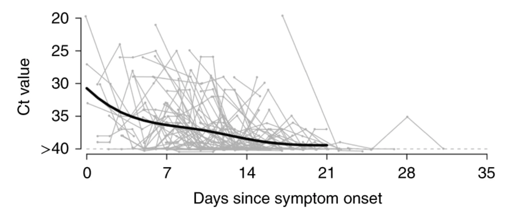
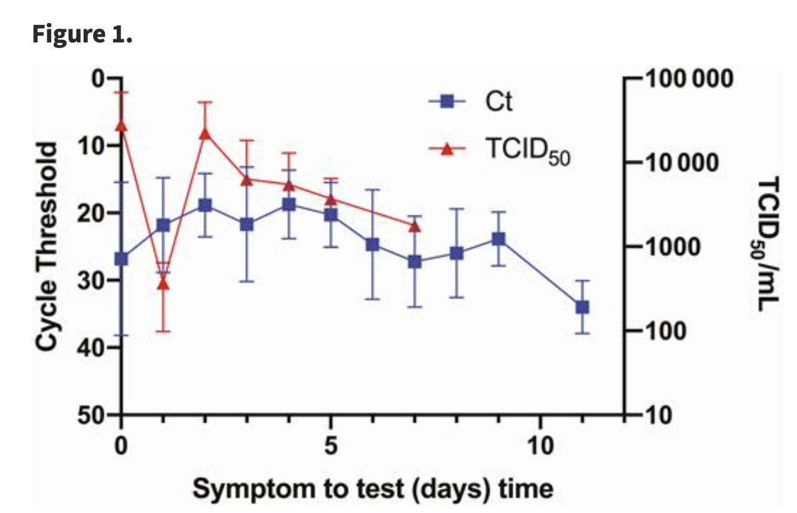
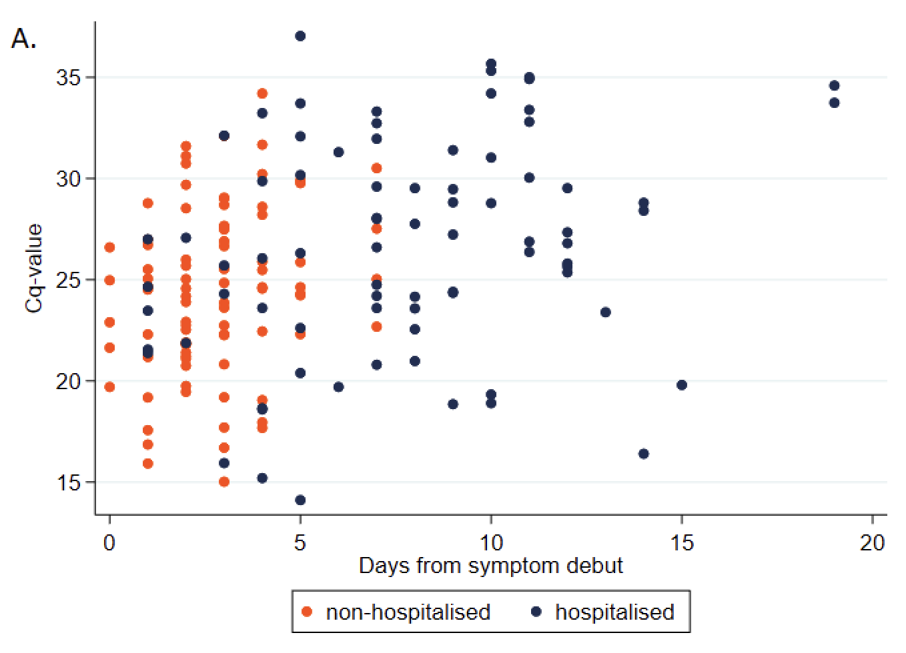

```{python}
#| label: load-packages
#| include: false
import seaborn as sns
import pandas as pd
import matplotlib.pyplot as plt
import numpy as np
from collections import defaultdict
import random
import math
from scipy.stats import gmean
import matplotlib.ticker as ticker
from scipy.stats import linregress
import argparse
from typing import List

```

```{python}
#| label: define-functions

def simulate_complex(shedding_values: List[float] = [0.01],
                     sample_populations: List[int] = [100],
                     n_simulations: int = 1000) -> pd.DataFrame:

    results = defaultdict(list)
    for sample_pop in sample_populations:
        for _ in range(n_simulations):
            results[sample_pop].append(simulate_once(sample_pop, shedding_values))
    for key, values in results.items():
        results[key] = sorted(values)
    df = pd.DataFrame(results)
    return df

def simulate_once(sample_pop=100, shedding_values=[0.01]):
    day = 0
    population = 1e10
    processing_delay = 4
    n_sites = 1
    n_min_observations = 2 # check what this means.
    epsilon = 0.000001
    genome_length_covid = 30_000
    sequencing_depth = 8e5
    read_length_usable = 10000 # Nanopore MinION

    sigma_shedding_values = 0.05
    doubling_time = 3
    cv_doubling_time = 0.1
    shedding_duration = 5
    sigma_shedding_duration = 0.05


    should_sample = {
        0: True,
        1: True,
        2: True,
        3: True,
        4: True,
        5: False,
        6: False,

    }

    should_sequence = {
        0: True,
        1: True,
        2: True,
        3: True,
        4: True,
        5: False,
        6: False,
    }

    r = math.log(2) / get_input_cv(doubling_time, cv_doubling_time, epsilon)
    growth_factor = math.exp(r)
    cumulative_incidence = 1 / population

    detectable_days = get_input_sigma(shedding_duration,sigma_shedding_duration, epsilon)

    ra_sicks = get_inputs_biased(shedding_values, sigma_shedding_values, epsilon)

    observations = 0

    site_infos = []
    for site in range(n_sites):
        site_infos.append({
            "sample_sick": 0,
            "sample_total": 0,
            "day_offset": random.randint(0, 6)  # Random day of the week
        })


    read_length_usable = min(read_length_usable, genome_length_covid) # not needed because we assume Illumina, but let's keep it for now

    #if low_quality_checked():
    #    read_length_usable = min(read_length_usable, 120)
    # CHECK, is this a condition I want to drop?
    fraction_useful_reads = read_length_usable / genome_length_covid

    v_processing_delay_factor = pow(growth_factor, processing_delay)
    n_reads = sequencing_depth


    while True:
        day += 1
        cumulative_incidence *= growth_factor
        if cumulative_incidence < 0:
            print(f"cumulative_incidence < 0: {cumulative_incidence}, {day}")
        for site_info in site_infos:
            day_of_week = (day + site_info["day_offset"]) % 7
            if should_sample[day_of_week]:
                daily_incidence = cumulative_incidence * r
                individual_probability_sick = 0
                effective_incidence = daily_incidence
                for _ in range(int(detectable_days)):
                    individual_probability_sick += effective_incidence
                    effective_incidence /= growth_factor
                n_sick = np.random.poisson(sample_pop * individual_probability_sick)
                site_info["sample_sick"] += n_sick
                site_info["sample_total"] += sample_pop

            if should_sequence[day_of_week]:
                ra_sick = 0
                if site_info["sample_sick"] == 0:
                    ra_sick = 0  # not technically true, but unused in this case.
                elif len(ra_sicks) == 1:
                    # If there's only one option, no need to simulate.
                    ra_sick = ra_sicks[0]
                elif site_info["sample_sick"] > len(ra_sicks) * 3:
                    # If we're sampling a lot of sick people, just average the
                    # possibilities instead of simulating, since simulating
                    # will be slow and not help much.
                    ra_sick = sum(ra_sicks) / len(ra_sicks)
                else:
                    # Actually simulate.
                    for _ in range(site_info["sample_sick"]):
                        ra_sick += ra_sicks[random.randint(0, len(ra_sicks) - 1)]
                    ra_sick = ra_sick / site_info["sample_sick"]

                probability_read_is_useful = (
                    site_info["sample_sick"] /
                    site_info["sample_total"] *
                    ra_sick * fraction_useful_reads # TODO: this assumes an engineered virus.
                )

                site_info["sample_sick"] = 0
                site_info["sample_total"] = 0

                # If this is zero it means that we didn't have any sick
                # people in our sample, so we don't need to check if we
                # observed any useful reads.
                if probability_read_is_useful > 0:
                    observations += np.random.poisson(n_reads * probability_read_is_useful)
                    if observations >= n_min_observations:
                        return cumulative_incidence * v_processing_delay_factor

        if cumulative_incidence > 1 or day > 365 * 10:
            return 1


def get_input_sigma(geom_mean, sigma, epsilon):

    if sigma < epsilon:
        return geom_mean

    return np.random.lognormal(math.log(geom_mean), sigma)

def get_input_cv(doubling_time, cv_doubling_time, epsilon):
    mean = doubling_time
    cv = cv_doubling_time

    if cv < epsilon:
        return mean

    stdev = cv * mean
    return np.random.normal(mean, stdev)


def get_inputs_biased(shedding_values, sigma_shedding_values, epsilon):
    empirical_values = shedding_values
    sigma = sigma_shedding_values
    if sigma < epsilon:
        return empirical_values

    # Don't want to bias each mean independently, bias all of them
    # together with log-normally distributed noise. The geometric mean
    # (and median) of the noise is zero, and the standard deviation is
    # provided by the user.

    bias = np.random.lognormal(0, sigma)

    adjusted_values = [empirical_value * bias for empirical_value in empirical_values]
    return adjusted_values

def format_func(value, tick_number):
    return r'$10^{{{}}}$'.format(int(value))

def return_studies():
    df_op_lu = pd.read_csv('data/lu_throat_ct_mgs.tsv', sep='\t', skiprows=1)
    df_op_lu.rename(columns={'SCV-2 Relative Abundance': 'scv2_ra', 'Ct value': 'scv2_ct'}, inplace=True)
    df_op_lu['patient_status'] = 'Inpatient'
    df_np_babiker = pd.read_csv('data/babiker_np_ct_mgs.tsv', sep='\t', skiprows=1)
    df_np_babiker.rename(columns={'SARS-CoV-2 RT-PCR Ct': 'scv2_ct', 'SARS-CoV-2 RA': 'scv2_ra', 'Inpatient/ED vs. Outpatient': 'patient_status'}, inplace=True)
    df_np_mostafa = pd.read_csv('data/mostafa_np_scv2_ct_mgs.tsv', sep='\t', skiprows=1)
    df_np_rodriguez = pd.read_csv('data/rodriguez_np_ct_mgs.csv', sep=';')

    mostafa_severity_dict = {
        1: "Required\nventilator",
        2: "ICU",
        3: "Inpatient",
        4: "Outpatient",
        0: "Unknown"
    }

    df_np_mostafa.rename(columns={'SARS-CoV-2 RT-PCR Ct': 'scv2_ct', 'SARS-CoV-2 RA': 'scv2_ra'}, inplace=True)
    df_np_mostafa['patient_status'] = df_np_mostafa['Severity Index'].astype(int).replace(mostafa_severity_dict)

    rodriguez_patient_status_dict = {
        "Hospit": "Inpatient",
        "Out_Patient": "Outpatient",
        "Intensive_Care": "ICU"
    }

    df_np_rodriguez['patient_status'] = df_np_rodriguez['Group'].replace(rodriguez_patient_status_dict)
    df_np_rodriguez["scv2_ra"] = df_np_rodriguez["Reads_2019_CoV"] / df_np_rodriguez["Reads_Post_trimming"]
    df_np_rodriguez = df_np_rodriguez[df_np_rodriguez["scv2_ra"] != 0] # Dropping Patient_066 because 0 ra breaks gmean

    df_np_rodriguez.rename(columns={"CoV_Ct_number": "scv2_ct"}, inplace=True)

    df_np_babiker['scv2_ct'] = df_np_babiker['scv2_ct'].replace(',', '.', regex=True).astype(float)

    df_op_lu['patient_status'] = 'Inpatient'  # All inpatients for Lu et al.
    df_np_babiker['patient_status'] = df_np_babiker['patient_status'].apply(lambda x: x if x in ['Inpatient', 'Outpatient'] else 'Unknown')

    df_op_lu["swab_type"] = "op"
    df_np_babiker["swab_type"] = "np"
    df_np_rodriguez["swab_type"] = "np"
    df_np_mostafa["swab_type"] = "np"
    return [df_np_babiker, df_np_rodriguez, df_op_lu, df_np_mostafa]

def rpkm_to_ra(df):
    genome_lengths_in_kb = {
        "Influenza A": 13.5,
        "Influenza B": 14.5,
        "Metapneumovirus": 13.3,
        "Rhinovirus": 7.2,
        "Parainfluenzavirus 1": 15.5,
        "Parainfluenzavirus 3": 15.5,
        "Parainfluenzavirus 4": 17.4,
        "Respiratory Syncytial Virus": 15.2
    }


    for virus, virus_length in genome_lengths_in_kb.items():
        df.loc[df["virus"] == virus, "relative_abundance"] = df.loc[df["virus"] == virus, "RPKM"] * virus_length / 1e6

    return df

```

The NAO aims to detect stealth pathogens at an early stage. Initially we mostly thought about detecting pathogens in wastewater, but we've recently expanded our research to also cover [air sampling](https://naobservatory.org/reports/air-sampling-for-early-pathogen-detection), created a more general framework with which to think about the promise of different [sampling strategies](https://naobservatory.org/reports/comparing-sampling-strategies-for-early-detection-of-stealth-biothreats), and built a simulator that is agnostic to the [underlying sampling method](https://naobservatory.org/blog/simulating-approaches-to-metagenomic-pandemic-identification).

One sample type we've been thinking about more recently is swab sampling. Jeff Kaufman recently wrote a piece that provides an initial estimate of the [sensitivity of swab sampling](https://www.jefftk.com/p/sequencing-swabs). The post here expands on this initial piece of work by using our more relative abundance advanced simulator on a larger set of swab sampling studies. Additionally we create a BOTEC estimate for what relative abundances could look like in the kind of sampling program we envision (collect anterior nasal swabs (heretofore called nasal swabs) from a random sample of people at an airport terminal or some other public location).

In summary, ....

### Lu et al. 2021

Jeff originally wrote a post that is based on Lu et al. 2021, which sampled Chinese patients with oropharyngeal swabs (throat, or OP swabs). The paper gives little information on patient characteristics. COVID-19 abundance in Lu et al. 2021 is fairly high with a mean relative abudance of 2x10<sup>-3</sup> (n=16).

```{python}
#| warning: false
#| fig-cap: "**Figure 1: qPCR CT values and relative abundance for Lu et al. 2021.**"
df_op_lu = pd.read_csv('data/lu_throat_ct_mgs.tsv', sep='\t', skiprows=1)
df_op_lu.rename(columns={'SCV-2 Relative Abundance': 'scv2_ra', 'Ct value': 'scv2_ct'}, inplace=True)

fig, ax = plt.subplots(figsize=(9, 4))
sns_default_colors = sns.color_palette()

x_lim = 12.5, 40
y_lim = 10**-8, 2

sns.scatterplot(ax=ax, data=df_op_lu, x='scv2_ct', y='scv2_ra', color=sns_default_colors[0], s=70)
ax.set_xlabel('SARS-CoV-2 qPCR CT Value')
ax.set_xlim(x_lim)
y_lim_adjusted = (y_lim[0], y_lim[1] * 1.05)  # Adjust upper limit to ensure top dot is fully displayed
ax.set_ylim(y_lim_adjusted)
ax.set_title("Lu et al. 2021 - Throat Swabs", x=0.00, y=1.0, ha='left')

ax.set_yscale('log')
ax.invert_xaxis()
ax.spines['right'].set_visible(False)
ax.spines['top'].set_visible(False)
ax.tick_params(axis='y', which='both', left=False, right=False, labelleft=True)
ax.set_ylabel('Relative Abundance')
for x in np.arange(15, 40, 5):
    ax.axvline(x=x, color='grey', linestyle='--', alpha=0.5, linewidth=0.5)
for y in range(-7, 1, 1):
    log_y = 10**y
    ax.axhline(y=log_y, color='grey', linestyle='--', alpha=0.5, linewidth=0.5)

plt.show()
```

We can use this data to estimate the expected cumulative incidence upon detection. Let's say we get a random set of swabs on each weekday, pooling and sequencing them using a Nanopore MinION which produces 800,000 reads. We need two suspicious reads for detection (where there is only one genetic site within the pathogen that is suspicious). If we vary the number of swabs, ranging from 50 to 800, median cumulative incidence is expected to be 2% when sampling 50 swabs, 1.2% when sampling 100 swabs, 0.6 % at 200 swabs, 0.4% at 400 swabs, and 0.2% at 800 swabs. That's pretty good!
```{python}
#| warning: false
#| fig-cap: "**Figure 2: Simulated cumulative incidence at time of detection for Lu et al. 2021.**\n Assuming swab sample sizes ranging from 50-800."
df_op_lu_ras = df_op_lu['scv2_ra'].dropna().to_list()
fig, ax = plt.subplots(figsize=(10,6),dpi=600)
n_swab_range = [50,100, 200, 400, 800]
studies = ["Lu"]
for i, (study, positive_ras) in enumerate(zip(studies, [df_op_lu_ras])):
    df = simulate_complex(positive_ras, n_swab_range)
    ax.yaxis.set_major_formatter(ticker.FuncFormatter(lambda y, _: '{:.0%}'.format(y)))

    for n_swabs in n_swab_range:
        ax.plot(df.index/10, df[n_swabs], label=f'{n_swabs} swabs')
    ax.set_xlabel('Percentile')
    ax.set_ylabel('Cumulative incidence')
    #ax.set_yscale('log')
    ax.yaxis.set_tick_params(labelleft=True)
    ax.axvline(x=50, color='red', linestyle='--', alpha=0.5)
    ax.axvline(x=10, color='red', linestyle='--', alpha=0.5)
    ax.axvline(x=90, color='red', linestyle='--', alpha=0.5)

    ymin, ymax = ax.get_ylim()
    ax.text(x=51, y=ymax, s='Median', color='black', fontsize=10, ha='left')
    ax.text(x=11, y=ymax, s='10%', color='black', fontsize=10, ha='left')
    ax.text(x=91, y=ymax, s='90%', color='black', fontsize=10, ha='left')

    for y in range(0, int(ymax*100), 1):
        y = y/100
        ax.axhline(y=y, color='black', linestyle='--', linewidth=0.3, alpha=0.2)

    for x in range(0, 100, 10):
        ax.axvline(x=x, color='black', linestyle='--', linewidth=0.3, alpha=0.2)

    ax.tick_params(axis='y', which='both', left=False, right=False, labelleft=True)
    ax.tick_params(axis='x', which='both', bottom=False, top=False, labelbottom=True)
    ax.set_xticks(range(0, 100, 10))

    ax.set_xticklabels(['{}%'.format(x) for x in range(0, 100, 10)])

    #ax.set_ylim(10**-10, 10**-1)

    ax.set_xlabel('')

    ax.spines['right'].set_visible(False)
    ax.spines['top'].set_visible(False)

    ax.legend(title='', loc='upper center', bbox_to_anchor=(1.1, 0.6), ncol=1, frameon=False)
plt.show()

```

Let's take a closer look at the median outcome. If we run the simulation for each swab sample size between 50 and 800, pick the median cumulative incidence and plot the medians only we get the following curve. This still looks quite good: when we  use more than 200 swabs we reliably get a cumulative incidence that is below 1%. But what happens if we use a different study as our "ground truth" for the expected relative abundance in swabs?


```{python}
#| warning: false
#| fig-cap: "**Figure 3: Simulated cumulative incidence at time of detection for Lu et al. 2021.**\n Median outcome for sample sizes between 1 and 800 swabs."
df_op_lu_ras = df_op_lu['scv2_ra'].dropna().to_list()
fig, ax = plt.subplots(figsize=(10,6),dpi=600)
n_swab_range = range(50, 800, 1)
studies = ["Lu"]
for i, (study, positive_ras) in enumerate(zip(studies, [df_op_lu_ras])):
    df = simulate_complex(positive_ras, n_swab_range, n_simulations=100)
    df_median = pd.DataFrame(df.iloc[len(df.index)//2])
    df_median.columns = ['cumulative_incidence']
    df_median.index.name = 'n_swabs'

    ax.plot(df_median.index, df_median['cumulative_incidence'])

    ax.set_xlabel('Swab sample size')
    ax.set_ylabel('Cumulative incidence')

    y_min, y_max = ax.get_ylim()
    for y in np.arange(0, y_max, 0.005):
        ax.axhline(y=y, color='black', linestyle='--', linewidth=0.3, alpha=0.2)
    x_min, x_max = ax.get_xlim()
    for x in np.arange(100, x_max, 100):
        ax.axvline(x=x, color='black', linestyle='--', linewidth=0.3, alpha=0.2)

    ax.spines['right'].set_visible(False)
    ax.spines['top'].set_visible(False)
    #ax.legend(title='', loc='upper center', bbox_to_anchor=(1.1, 0.6), ncol=1, frameon=False)
plt.show()

```


### Additional SARS-CoV-2 studies

Lu et al. 2021 is a relatively small sample of inpatients in Wuhan but there are other studies that have done similar work. Limiting ourselves to COVID-19, there is Babiker et al. 2020, which sampled poth inpatients and outpatients using nasopharyngeal swabs, Mostafa et al. 2020, which sampled nasal swabs from patients which range from being outpatients to individuals that required a ventilator and Rodriguez et al. 2021, which sampled nasopharyngeal swabs from inpatients and outpatients. We call these studies "target studies" heretoforth. The average relative SARS-CoV-2 relative abundance for Babiker et al. 2020 is 2x10<sup>-4</sup> (n=44), 10<sup>-4</sup> for Mostafa et al. 2020 (n=33), and 1.2x10<sup>-3</sup>. This compares to a relative abudance of 2x10<sup>-3</sup> (n=16) in  Lu et al. 2021 (Fig 4).

```{python}
#| warning: false
#| fig-cap: "**Figure 4: SARS-CoV-2 qPCR CT vs SARS-CoV-2 RA.**\nFirst Figure: Throat Swabs. Data from Lu et al. 2021. Second Figure: NP Swabs. Data from Babiker et al. 2020. Third Figure: Nasal Swabs. Data from Mostafa et al. 2020. Fourth Figure: Nasal Swabs. Data from Rodriguez et al. 2021."
df_np_babiker, df_np_rodriguez, df_op_lu, df_np_mostafa = return_studies()

fig, axs= plt.subplots(4, 1, figsize=(7.5, 12),dpi=600)
fig.subplots_adjust(hspace=0.3)
studies = ["Lu et al. 2021", "Babiker et al. 2020", "Mostafa et al. 2020", "Rodriguez et al. 2021"]
for ax, df, study in zip(axs, [df_op_lu, df_np_babiker, df_np_mostafa, df_np_rodriguez], studies):
    sns_default_colors = sns.color_palette()
    #viridis clor palette with 5 colors
    viridis_colors = sns.color_palette("CMRmap", 5)

    x_lim = 12.5, 40
    y_lim = 10**-8, 2
    if study == "Lu et al. 2021":
        sns.scatterplot(ax=ax, data=df, x='scv2_ct', y='scv2_ra', color=sns_default_colors[0], s=70)
        ax.set_xlabel('')
        ax.set_xlim(x_lim)
        y_lim_adjusted = (y_lim[0], y_lim[1] * 1.05)  # Adjust upper limit to ensure top dot is fully displayed
        ax.set_ylim(y_lim_adjusted)
        ax.legend(labels=['Inpatient'], loc="center left", bbox_to_anchor=(1, 0.5), frameon=False)
        ax.set_title(study + " - Throat Swabs", x=0.00, y=1.0, ha='left')
    elif study == "Babiker et al. 2020":
        order = ["Inpatient", "Outpatient",]
        sns.scatterplot(ax=ax, data=df, x='scv2_ct', y='scv2_ra', hue='patient_status', style='patient_status', palette=sns_default_colors, s=70, hue_order=order)
        ax.set_xlabel('')
        ax.legend(title='', loc="center left", bbox_to_anchor=(1, 0.5), frameon=False)
        ax.set_xlim(x_lim)
        ax.set_ylim(y_lim)
        ax.set_title(study + " - NP Swabs", x=0.00, y=1.0, ha='left')
    elif study == "Mostafa et al. 2020":
        sns.scatterplot(ax=ax, data=df, x='scv2_ct', y='scv2_ra', hue='patient_status', palette=sns_default_colors, s=70, style='patient_status')
        ax.set_xlabel('')
        ax.set_xlim(x_lim)
        ax.set_ylim(y_lim)
        ax.legend(title='', loc="center left", bbox_to_anchor=(1, 0.5), frameon=False)
        ax.set_title(study + " - Nasal Swabs", x=0.00, y=1.0, ha='left')
    elif study == "Rodriguez et al. 2021":
        order = ["Inpatient", "Outpatient", "ICU"]
        sns.scatterplot(ax=ax, data=df, x='scv2_ct', y='scv2_ra', hue='patient_status', style='patient_status', s=70, hue_order=order)
        ax.set_xlabel('SARS-CoV-2 qPCR CT Value')
        ax.legend(title='', loc="center left", bbox_to_anchor=(1, 0.5), frameon=False)
        ax.set_xlim(x_lim)
        ax.set_ylim(y_lim)
        ax.set_title(study + " - NP Swabs", x=0.00, y=1.0, ha='left')


    ax.set_yscale('log')
    ax.invert_xaxis()
    ax.spines['right'].set_visible(False)
    ax.spines['top'].set_visible(False)
    ax.tick_params(axis='y', which='both', left=False, right=False, labelleft=True)
    ax.set_ylabel('Relative Abundance')
    for x in np.arange(15, 40, 5):
        ax.axvline(x=x, color='grey', linestyle='--', alpha=0.5, linewidth=0.5)
    for y in range(-7, 1, 1):
        log_y = 10**y
        ax.axhline(y=log_y, color='grey', linestyle='--', alpha=0.5, linewidth=0.5)
```


```{python}
#| label: target-studies-ct-ra-mean
#| include: false
df_np_babiker, df_np_rodriguez, df_op_lu, df_np_mostafa = return_studies()

print(gmean(df_op_lu['scv2_ra']))
print(len(df_op_lu))
print(gmean(df_np_babiker['scv2_ra']))
print(len(df_np_babiker))
print(gmean(df_np_mostafa['scv2_ra']))
print(len(df_np_mostafa))
print(gmean(df_np_rodriguez['scv2_ra']))
print(len(df_np_rodriguez))

```

Let's recreate Figure 3 for these new studies. Again, we assume a swab sampling program that sampled 50-800 swabs a day. If we take the relative abundance values of these three studies as the relative abundance we'd expect to see in a swab sampling program Lu et al. 2021 shows a cumulative incidence of 0.6% (200 swabs) and 0.3 % (400 swabs), Babiker et al. 2020 shows 1.2% and 0.9%, Mostafa et al. 2020 1.7% and 1.4% and Rodriguez et al. 0.7% and 0.3% respectively.


```{python}
#| warning: false
#| echo: false
#| fig-cap: "**Figure 5: Simulated RA(1%) for Lu et al. 2021, Babiker et al. 2020, Mostafa et al. 2020, and Rodriguez et al. 2021.**\n Assuming swab sample sizes between 50 and 800."

fig, axs= plt.subplots(2,2, figsize=(8, 8), sharey=True)
fig.subplots_adjust(hspace=0.5)
df_op_lu_ras = df_op_lu['scv2_ra'].dropna().tolist()
df_np_babiker_ras = df_np_babiker['scv2_ra'].dropna().tolist()
df_np_mostafa_ras = df_np_mostafa['scv2_ra'].dropna().tolist()
df_np_rodriguez_ras = df_np_rodriguez['scv2_ra'].dropna().tolist()

studies = ["Lu et al. 2021", "Babiker et al. 2020", "Mostafa et al. 2020", "Rodriguez et al. 2021"]

n_swab_range = range(50, 800, 1)
y_min, y_max = 0,0
axs = axs.flatten()
for ax, study, positive_ras in zip(axs, studies, [df_op_lu_ras, df_np_babiker_ras, df_np_mostafa_ras, df_np_rodriguez_ras]):
    df = simulate_complex(positive_ras, n_swab_range, n_simulations=100)
    df_median = pd.DataFrame(df.iloc[len(df.index)//2])
    df_median.columns = ['cumulative_incidence']
    df_median.index.name = 'n_swabs'
    #print(study, "200 swabs:", df_median.loc[200], "400 swabs:", df_median.loc[400])

    ax.plot(df_median.index, df_median['cumulative_incidence'])

    ax.set_xlabel('Swab sample size')
    ax.set_ylabel('Cumulative incidence')
    ax.set_title(study)

    local_y_min, local_y_max = ax.get_ylim()
    if local_y_max > y_max:
        y_max = local_y_max

    x_min, x_max = ax.get_xlim()
    for x in np.arange(100, x_max, 100):
        ax.axvline(x=x, color='black', linestyle='--', linewidth=0.3, alpha=0.2)

    ax.spines['right'].set_visible(False)
    ax.spines['top'].set_visible(False)
    #ax.legend(title='', loc='upper center', bbox_to_anchor=(1.1, 0.6), ncol=1, frameon=False)


for ax in axs:
    for x in np.arange(y_min, y_max, 0.01):
        ax.axhline(y=x, color='black', linestyle='--', linewidth=0.3, alpha=0.2)

plt.show()

```

## What would a more representative sample look like?

The studies we've looked at all have issues that keep them from being representative of the sort of population sampling we're considering. There are four different aspects we can look at:

1. Most patients were hospitalized, but in a hypothetical sampling program individuals would either be asymptomatic or only slightly sick (otherwise they would stay home)
2. Likely close to all patients were symptomatic, but the kind of stealth pathogen we are looking for would be expected to show no symptoms.
3. Studies either used nasopharyngeal swabs ( Babiker et al. 2020, Mostafa et al. 2020, and Rodriguez et al. 2021), or oropharyngeal swabs (Lu et al. 2021) but a sampling program would most likely use anterior nasal swabs.
4. Finally, many of the inpatients covered by our four target studies were sampled later in their disease course, but viral loads are highest just when symptoms begin. But when sampling asymptomatic individuals the time between testing and initial infection would likely be random and sampling could thus occur more closely to the start of symptoms when compared to inpatients.

Let's see if we can get an intuition for the magnitude for these effects.


### Swab type

#### Nasopharyngeal vs Nasal swabs

Both Babiker et al. 2020, Mostafa et al. 2020, and Rodriguez et al. 2021 used nasopharyngeal swabs. We found five studies that performed paired sampling and SARS-CoV-2 qPCR of the same patients: Patriquin et al. 2022, McCulloch et al. 2020, Pere et al 2020, Kojima et al. 2020, and Tu et al. 2020. For each of these studies we have individual data points for each sample pair. By computing the CT difference within each pair, and averaging these differences we get an average CT difference for each study (Table S1, Fig.6). Averaging these values again without weighing studies we get an average difference of **-1.82** CT values, where negative values mean that nasopharyngeal swabs have lower CT values and are thus more sensitive.

```{python}
#| label: median_iqr_ct_diff_np_nasal
#| include: false
#| echo: false
#| output: false
df = pd.read_csv('data/np-nasal-ct.tsv', sep='\t', skiprows=1)

study_means = []
for col in df.columns:
    study_means.append(df[col].mean())
mean_of_study_means = sum(study_means) / len(study_means)
print(mean_of_study_means)
```


```{python}
#| label: np_nasal_ct_plot
#| fig-cap: "**Figure 6: Nasal swabs vs nasopharyngeal swabs.** Data from Patriquin et al. 2022, McCulloch et al. 2020, Pere et al. 2020, Kojima et al. 2020, and Tu et al. 2020."

df = pd.read_csv('data/np-nasal-ct.tsv', sep='\t', skiprows=1)

df = df.melt(var_name='Study', value_name='CT Difference')


pretty_study_names = {
    "Patriquin2022": "Patriquin et al. 2022",
    "McCulloch2020": "McCulloch et al. 2020",
    "Pere2020": "Pere et al. 2020",
    "Kojima2020": "Kojima et al. 2020",
    "Tu2020": "Tu et al. 2020"
}

df['Study'] = df['Study'].map(pretty_study_names).values

mean_ct_diff = df.groupby('Study', as_index=False)['CT Difference'].mean()
fig = plt.figure(figsize=(8, 4),dpi=600)


sns.stripplot(data=df, y='Study', x='CT Difference', hue='Study', jitter=True,zorder=-1)
sns.pointplot(data=mean_ct_diff, y='Study', x='CT Difference', linestyles='none', markers='D', color='#36454F', markersize=5, errorbar=None,zorder=1)

plt.legend([],[], frameon=False)
plt.ylabel('')
plt.xlabel('SARS-CoV-2 qPCR CT Δ (NP - Nasal)')
plt.tick_params(axis='y', which='both', left=False, right=False, labelleft=True)


x_min, x_max = plt.xlim()
#round up xmin and xmax to the nearest 5
x_min = math.ceil(x_min / 5) * 5
x_max = math.ceil(x_max / 5) * 5

x_marks = np.arange(x_min, x_max, 2.5)
for x in x_marks:
    plt.axvline(x=x, color='grey', linestyle='--', alpha=0.5, linewidth=0.5)


plt.axvline(x=0, color='red', linestyle='--', alpha=0.5)

#plt.xticks(x_marks)


min_x, max_x = plt.xlim()

plt.text(max_x/2,-0.6, 'Favors Nasal', fontsize=10, color='black', ha='center')
plt.text(min_x/2,-0.6, 'Favors Nasopharyngeal', fontsize=10, color='black', ha='center')

plt.gca().spines['right'].set_visible(False)
plt.gca().spines['top'].set_visible(False)
plt.gca().spines['left'].set_visible(False)

```

##### Oropharyngeal vs Nasal swabs

Lu et al. 2021 uses oropharyngeal swabs. We can adjust this swab type by looking at the studies , Leungt et al. 2022, Goodall et al. 2022 and Berenger et al. 2020. We have raw data for Goodall et al. 2022, Leung et al. 2020, and median CT values for Berenger et al. 2022. Averaging the qPCR results for qPCR target N and ORF1a for each sample, Goodall et al. 2022 showed an average CT value difference (OP-Nasal) of **1** Ct value in favor of nasal swabs. In Berenger et al. 2022 the difference between medians (OP - NP) was 1.1 (E gene) and 0.8 (RdRp). This gives an across-study average difference of 1 CT value, maing OP swabs less sensitive than nasal swabs.


```{python}
#| fig-cap: "**Figure 7: Nasal swabs vs Oro-pharyngeal swabs.** Data is taken from Goodall et al. 2022 and Leung et al 2020."

df = pd.read_csv('data/goodall-op-nasal-ct.tsv', sep='\t', skiprows=1)
pretty_study_names = {
    "Goodall2022": "SARS-CoV-2",
    "Leung2022": "Leung et al. 2020",
}
df = df.melt(var_name='Study', value_name='CT Difference')
df['Study'] = df['Study'].map(pretty_study_names).values
mean_ct_diff = df.groupby('Study', as_index=False)['CT Difference'].mean()

fig, axs = plt.subplots(2, 1, figsize=(8,4),  dpi=600, gridspec_kw={'height_ratios': [1.5, 3]})


fig.subplots_adjust(hspace=0.6)

sns.stripplot(data=df, y='Study', x='CT Difference', hue='Study', jitter=True, zorder=-1, ax=axs[0])
sns.pointplot(data=mean_ct_diff, y='Study', x='CT Difference', linestyles='none', markers='D', color='#36454F', markersize=5, errorbar=None, zorder=1, ax=axs[0])
axs[0].legend([],[], frameon=False)


axs[0].set_ylabel('')
axs[0].set_xlabel(u'SARS-CoV-2 qPCR CT Δ (OP - Nasal)')
axs[0].tick_params(axis='y', which='both', left=False, right=False, labelleft=True)
axs[0].text(-0.25, 1.4, 'Fig. 7A: Goodall et al. 2022', transform=axs[0].transAxes, fontsize=10, verticalalignment='top', horizontalalignment='left')
x_min, x_max = axs[0].get_xlim()
#round up xmin and xmax to the nearest 5
x_min = math.ceil(x_min / 5) * 5
x_max = math.ceil(x_max / 5) * 5

x_marks = np.arange(x_min, x_max, 2.5)
for x in x_marks:
    axs[0].axvline(x=x, color='grey', linestyle='--', alpha=0.5, linewidth=0.5)
axs[0].axvline(x=0, color='red', linestyle='--', alpha=0.5)

axs[0].axhline(y=0.5, color='grey', linestyle='--', alpha=0.5, linewidth=0.5)

min_x, max_x = axs[0].get_xlim()

axs[0].text(max_x/2,-0.6, 'Favors Nasal Swab', fontsize=9, color='black', ha='center')
axs[0].text(min_x/2,-0.6, 'Favors Oro-pharyngeal', fontsize=9, color='black', ha='center')


axs[0].spines['right'].set_visible(False)
axs[0].spines['top'].set_visible(False)
axs[0].spines['left'].set_visible(False)

df = pd.read_csv('data/leung_genome_copy_differences.tsv', sep='\t', skiprows=1)

df = df.melt(var_name='Study & Comparison', value_name='Genome Copy Number Difference')
df['Study & Comparison'] = df['Study & Comparison'].str.split(',').str[-1]
mean_ct_diff = df.groupby('Study & Comparison')['Genome Copy Number Difference'].mean().reset_index()

sns.stripplot(data=df, y='Study & Comparison', x='Genome Copy Number Difference', hue='Study & Comparison', jitter=True, alpha=0.6, zorder=1, ax=axs[1])
sns.pointplot(data=mean_ct_diff, y='Study & Comparison', x='Genome Copy Number Difference', linestyles='none', markers='D', color='#36454F', markersize=5, errorbar=None, zorder=1, ax=axs[1])
plt.legend([],[], frameon=False)
# drop y axis label
axs[1].set_ylabel('')
axs[1].set_xlabel(u'Genome Copy Number Δ (Nasal - OP), Logged')
axs[1].text(-0.25, 1.1, 'Fig. 7B: Leung et al. 2020', transform=axs[1].transAxes, fontsize=10, verticalalignment='top', horizontalalignment='left')

# flip x axis
axs[1].tick_params(axis='y', which='both', left=False, right=False, labelleft=True)
for x in -2, 0, 2, 4, 6:
    if x == 0:
        axs[1].axvline(x=x, color='red', linestyle='--', alpha=0.5)
        continue
    axs[1].axvline(x=x, color='grey', linestyle='--', alpha=0.5, linewidth=0.5)

for y in 0.5, 1.5:
    axs[1].axhline(y=y, color='grey', linestyle='--', alpha=0.5, linewidth=0.5)

min_x, max_x = axs[1].get_xlim()


axs[1].spines['right'].set_visible(False)
axs[1].spines['top'].set_visible(False)
axs[1].spines['left'].set_visible(False)

plt.show()


```


### Inpatient vs Outpatient

```{python}
#| label: target-studies-patient-composition
#| warning: false
#| fig-cap: "**Figure 8: Patient composition of Lu et al. 2021, Babiker et al. 2020, Mostafa et al. 2020, and Rodriguez et al. 2021.**"

df_np_babiker, df_np_rodriguez, df_op_lu, df_np_mostafa = return_studies()
order = ['Inpatient', 'Outpatient', 'Required\nventilator', 'ICU', 'Unknown']

lu_counts = df_op_lu['patient_status'].value_counts().reindex(order)
babiker_counts = df_np_babiker['patient_status'].value_counts().reindex(order)
mostafa_counts = df_np_mostafa['patient_status'].value_counts().reindex(order)
rodriguez_counts = df_np_rodriguez['patient_status'].value_counts().reindex(order).dropna()

fig, axs = plt.subplots(1, 4, figsize=(12, 4), width_ratios=[0.7, 1.5, 4, 2.4], sharey=True, dpi=800)

colors = sns.color_palette()
color_dict = {
   'Inpatient': colors[0],
    'Outpatient': colors[1],
    'Required\nventilator': colors[2],
    'ICU': colors[3],
    'Unknown': colors[4]
}

axs[0].bar(lu_counts.index, lu_counts.values, color=color_dict['Inpatient'], width=0.5)
axs[0].set_title('Lu et al. 2021')
axs[0].set_ylabel('Count')
axs[0].set_ylim(0, max(lu_counts.values) + 5)

axs[1].bar(babiker_counts.index, babiker_counts.values, color=[color_dict[x] for x in babiker_counts.index], width=0.8)
axs[1].set_title('Babiker et al. 2020')
axs[1].set_ylim(0, max(babiker_counts.values) + 5)

axs[2].bar(mostafa_counts.index, mostafa_counts.values, color=[color_dict[x] for x in mostafa_counts.index])
axs[2].set_title('Mostafa et al. 2020')
axs[2].set_ylim(0, max(mostafa_counts.values) + 10)
axs[2].set_yticks(np.arange(0, max(mostafa_counts.values) + 30, 10))

axs[3].bar(rodriguez_counts.index, rodriguez_counts.values, color=[color_dict[x] for x in rodriguez_counts.index])
axs[3].set_title('Rodriguez et al. 2021')
axs[3].set_ylim(0, max(rodriguez_counts.values) + 5)
axs[3].set_yticks(np.arange(0, max(rodriguez_counts.values) + 10, 5))

for ax in axs:
    ax.spines['right'].set_visible(False)
    ax.spines['top'].set_visible(False)
    ax.tick_params(axis='y', which='both', left=False, right=False, labelleft=True)
    ax.tick_params(axis='x', which='both', top=False, bottom=False, labeltop=False, labelbottom=True)
    ax.set_ylabel('')
    for x in np.arange(0, 40, 10):
        ax.axhline(y=x, color='grey', linestyle='--', alpha=0.5, linewidth=0.5, zorder=-1)

plt.tight_layout()
plt.show()
```

We can adjust for this somewhat by looking at the average difference of the CT values for inpatients and outpatients (Table 1). It's worth noting that inpatients typically have **higher** CT values, which is unexpected, given that they are likely to be sicker.

| Study | Sample size | Sample type| Inpatient CT (median, IQR) | Outpatient CT (median, IQR) | CT value difference (Inpatient - Outpatient)|
|-------|-------------|------------|----------------------------|-------------------------------|-----|
| [Souverein et al. 2022](https://academic.oup.com/ofid/article/9/7/ofac223/6576478#:~:text=26.3%20(IQR%2C%205.7).-,Association%20Between%20Cp%20Value%20and%20Hospital%20Admission,-Of%20the%2020)  | 19897 outpatients, 310 inpatients | OP/NP  |26.3 (5.6) | 25.0 (5.2) | 1.3 |
| [Knudtzen et al. 2021](https://journals.plos.org/plosone/article?id=10.1371/journal.pone.0258421#:~:text=SARS%2DCoV%2D2%20PCR%20Cq%2Dvalue%20as%20a%20marker%20for%20hospital%20admission) | 87 outpatients, 82 inpatients | 13 OP/NP, 130 OP, 26 sputum | 26.9 (7.7) | 24.6 (6.7)| 2.3|
| [Babiker et al. 2020](https://journals.asm.org/doi/10.1128/jcm.02142-20) | 10 outpatients, 34 inpatients | NP | 24.25 (7.8) | 25.35 (5.8) | -1.1|
| [Rodriguez et al. 2021](https://journals.plos.org/plospathogens/article?id=10.1371/journal.ppat.1009416#sec010) | 42 outpatients, 17 inpatients | NP | 30.0 (7.0) | 24.0 (6.8) | 6 |
: Table 1: Studies that sampled both inpatients and outpatients (includes two of our target studies)

### Disease onset

The lower viral load in inpatients is most likely caused by them entering the hospital later. Indeed, as we see in Knudtzen et al. 2021 which ran a prospective cohort study on a inpatient and outpatient cohort, the inpatient samples were collected later.


: Relationship between days since symptom onset and viral load.](img/knudtzen-et-al-2021.png)


Two other studies also provide data on viral load in relation to disease onset: Bullard et al. 2020 and He et al. 2020.

| Study Name| No. of patients | Swab type| Patient type |
|-----------|-----------------|----------|--------------|
| [Knudtzen et al. 2021](https://journals.plos.org/plosone/article?id=10.1371/journal.pone.0258421) | 169 | NP and/or OP, Saliva | 87 outpatients, 82 stationary |
| [Bullard et al. 2020](https://academic.oup.com/cid/article/71/10/2663/5842165) | 90 | NP or endotracheal (ETT) | Samples at a public health lab |
| [He et al. 2020](https://www.nature.com/articles/s41591-020-0869-5) | 94 | throat | inpatients (none were severe or critically ill) |
: Table 2: Studies that provide information on viral load in relation to disease onset.

Looking at this data there is a fairly clear relationship between time and lower viral load. (Need to account for the outlier in Knudtzen et al. inpatients where a couple of patients that were tested very late showed lot CT values)

```{python}
#| warning: false
#| fig-cap: "**Figure 9: qPCR CT Value vs Days since symptom onset** Data is taken from Knudtzen et al. 2021, Bullard et al. 2020, and He et al. 2020."

df_knudtzen_ct_days = pd.read_csv('data/knudtzen2021_ct_days.tsv', sep='\t', skiprows=1)
df_bullard_ct_days = pd.read_csv('data/bullard2021_ct_days.tsv', sep='\t', skiprows=1)
df_he_ct_days = pd.read_csv('data/he2020_ct_days.tsv', sep='\t', skiprows=1)

df_knudtzen_outpatients = df_knudtzen_ct_days[df_knudtzen_ct_days['Patient Status'] == 'Outpatient']
df_knudtzen_inpatients =  df_knudtzen_ct_days[df_knudtzen_ct_days['Patient Status'] == 'Inpatient']

# Round "Day" column to nearest full number for all dataframes
df_knudtzen_outpatients['Day'] = df_knudtzen_outpatients['Day'].round()
df_knudtzen_inpatients['Day'] = df_knudtzen_inpatients['Day'].round()
df_bullard_ct_days['Day'] = df_bullard_ct_days['Day'].round()
df_he_ct_days['Day'] = df_he_ct_days['Day'].round()

# For each dataframe, reset CT to be the average CT for each Day.
# For each dataframe, reset CT to be the average CT for each Day.
df_knudtzen_outpatients = df_knudtzen_outpatients.groupby('Day', as_index=False).agg({'CT': 'mean'})
df_knudtzen_inpatients = df_knudtzen_inpatients.groupby('Day', as_index=False).agg({'CT': 'mean'})
df_bullard_ct_days = df_bullard_ct_days.groupby('Day', as_index=False).agg({'Median CT': 'mean'}).rename(columns={'Median CT': 'CT'})
df_he_ct_days = df_he_ct_days.groupby('Day', as_index=False).agg({'CT': 'mean'})

df_knudtzen_outpatients['CT_rolling_mean'] = df_knudtzen_outpatients.groupby('Day')['CT'].rolling(window=5, min_periods=1, center=True).mean().reset_index(drop=True)
df_knudtzen_inpatients['CT_rolling_mean'] = df_knudtzen_inpatients.groupby('Day')['CT'].rolling(window=5, min_periods=1, center=True).mean().reset_index(drop=True)
df_bullard_ct_days['CT_rolling_mean'] = df_bullard_ct_days.groupby('Day')['CT'].rolling(window=5, min_periods=1, center=True).mean().reset_index(drop=True)
df_he_ct_days['CT_rolling_mean'] = df_he_ct_days.groupby('Day')['CT'].rolling(window=5, min_periods=1, center=True).mean().reset_index(drop=True)

combined_df = pd.concat([
    df_knudtzen_inpatients.assign(Study='Knudtzen et al. 2021 | Inpatients'),
    df_knudtzen_outpatients.assign(Study='Knudtzen et al. 2021 | Outpatients'),
    df_bullard_ct_days.assign(Study='Bullard et al. 2020'),
    df_he_ct_days.assign(Study='He et al. 2020')
])

fig, ax = plt.subplots(figsize=(10, 6),dpi=600)
sns.lineplot(data=combined_df, x='Day', y='CT_rolling_mean', hue='Study', ax=ax)

ax.set_xlabel('Days since symptom onset')
ax.set_ylabel('qPCR CT Value (3-day rolling average)')

ax.legend(title='', loc='lower center', bbox_to_anchor=(0.5, -0.3), ncol=2)

```


### Asymptomatic individuals

Finally, a further difference between our target studies and the ultimate sampling program we are considering is that sampled individuals would be asymptomatic. We identified four studies that researched this questions. Information on these papers can be found in Appendix 2.

| Study | Sample size | Sample type | Symptomatic CT Value (median, IQR) | Asymptomatic CT Value (median, IQR) |
|----------------------|----------------------------|----------------------|-------------------------------|-------------------------------|
| [Hall et al. 2022](https://doi.org/10.1371/journal.pone.0270694) | 357 asymptomatic, 1276 symptomatic or pre-symptomatic | Anterior nasal swab | N1: 21.8 (17.2-29.4), N2: 21.4 (17.3-28.9) | N1: 29.9 (23.6-35.5), N2: 30.0 (23.1-35.7) |
| [Long et al. 2020](https://doi.org/10.1038/s41591-020-0965-6) | 37 asymptomatic, 37 symptomatic | NP | ORF1ab: 31.7 (30.3-35.1), N: 33.5 (31.3-37.2) | ORF1ab: 32.8 (30.9-35.8), N: 32.6 (29.5-34.6) |
| [Lee et al. 2022](https://jamanetwork.com/journals/jamainternalmedicine/fullarticle/2769235) | 89 asymptomatic, 214 symptomatic | NP, OP, sputum | no raw data | no raw data |
| [Zhou et al. 2020](https://doi.org/10.1016/j.ijid.2020.05.030) | 9 asymptomatic, 22 pre-symptomatic | NP | 34.5 (32.2-37.0) | 39.0 (37.5-39.5) |
: Table 2: Viral load in symptomatic and asymptomatic individuals. Lee et al 2022 provides no raw data but noted that there was no significant difference between symptomatic and asympatomic individuals.

### A BOTEC for the sensitivity pooled swab sampling program

We can use the factors above to adjust the data in our target datasets. Note that this very much has the status of a BOTEC and would require more sophisticated modelling for us to put much faith in it. Anyway, let's for now:

1. Drop all samples that are from ICU or ventilator patients.
2. Adjust nasopharyngeal and oropharyngeal swabs by the adjustment factors discussed earlier (+1.82 for NP, -1 for OP samples)
3. Adjust inpatient samples by the observed difference to outpatient samples (-2.1) #TODISCUSS, this is clearly wrong.
4. Adjust all samples to resemble asymptomatics (+4.3)
5. #TODO Adjust for days.


```{python}
#| warning: false
#| fig-cap: "**Figure 10: Data extrapolated to asymptomatic individuals, sampled with anterior nasal swabs**"

df_np_babiker, df_np_rodriguez, df_op_lu, df_np_mostafa = return_studies()

df_np_babiker['Study'] = 'Babiker et al. 2020'
df_np_rodriguez['Study'] = 'Rodriguez et al. 2021'
df_op_lu['Study'] = 'Lu et al. 2021'
df_np_mostafa['Study'] = 'Mostafa et al. 2020'
composite_df = pd.concat([df_np_babiker, df_np_rodriguez, df_op_lu, df_np_mostafa], ignore_index=True)
composite_df = composite_df[composite_df['patient_status'].isin(['Inpatient', 'Outpatient'])]
inpatient_adjustment_factor = -2.1
asymptomatic_adjustment_factor = 4.3
np_adjustment_factor = 1
op_adjustment_factor = -1

# Apply the adjustment to Inpatient samples
composite_df["adjusted_scv2_ct"] = composite_df["scv2_ct"]
composite_df.loc[composite_df['patient_status'] == 'Inpatient', 'adjusted_scv2_ct'] += inpatient_adjustment_factor

composite_df["adjusted_scv2_ct"] = composite_df["adjusted_scv2_ct"] + asymptomatic_adjustment_factor

composite_df.loc[composite_df['swab_type'] == 'NP', 'adjusted_scv2_ct'] += np_adjustment_factor
composite_df.loc[composite_df['swab_type'] == 'OP', 'adjusted_scv2_ct'] += op_adjustment_factor

composite_df["scv2_ra_logged"] = composite_df["scv2_ra"].apply(np.log10)

result = linregress(composite_df['scv2_ct'], composite_df['scv2_ra_logged'])


composite_df["adjusted_scv2_ra_logged"] = result.intercept + result.slope * composite_df["adjusted_scv2_ct"]

fig, axs = plt.subplots(2,1,figsize=(8,6), sharey=True, dpi=600)
fig.subplots_adjust(hspace=0.5)  # Add vertical space between axs


composite_df["adjusted_scv2_ra_logged"] = result.intercept + result.slope * composite_df["adjusted_scv2_ct"]
composite_df["adjusted_scv2_ra_logged_stderr"] = np.sqrt(
    result.intercept_stderr**2 + (result.stderr * composite_df["adjusted_scv2_ct"])**2
)

# Generate random noise based on the standard errors
np.random.seed(42)  # Set a random seed for reproducibility
noise = np.random.normal(loc=0, scale=composite_df["adjusted_scv2_ra_logged_stderr"])

# Add the noise to the adjusted log relative abundance values
composite_df["adjusted_scv2_ra_logged_with_noise"] = composite_df["adjusted_scv2_ra_logged"] + noise

# Create scatter plots
sns.scatterplot(data=composite_df, y='scv2_ra_logged', x='scv2_ct', palette=sns_default_colors, s=70, hue='Study', style='Study', ax=axs[0])
sns.scatterplot(data=composite_df, y='adjusted_scv2_ra_logged_with_noise', x='adjusted_scv2_ct', palette=sns_default_colors, s=70, hue='Study', style='Study', ax=axs[1])
titles = ["Original values", "Adjusted CT and extrapolated RA value"]
for ax, title in zip(axs, titles):
    #ax.set_yscale('log')
    ax.set_xlabel('')
    ax.set_title(title)
    ax.legend([], [], frameon=False)
    #ax.set_xlim(x_lim)
    #y_lim_adjusted = (y_lim[0], y_lim[1] * 1.05)  # Adjust upper limit to ensure top dot is fully displayed
    #ax.set_ylim(y_lim_adjusted)
    ax.invert_xaxis()
    ax.spines['right'].set_visible(False)
    ax.spines['top'].set_visible(False)
    ax.tick_params(axis='y', which='minor', left=False, right=False, labelleft=True)
    ax.set_ylabel('Relative Abundance')
    ax.set_xlim(40,15)
    for x in np.arange(15, 40, 5):
        ax.axvline(x=x, color='grey', linestyle='--', alpha=0.5, linewidth=0.5)
    for y in range(-7, 1, 1):

        ax.axhline(y=y, color='grey', linestyle='--', alpha=0.5, linewidth=0.5)

axs[1].legend(title='', loc='lower center', bbox_to_anchor=(0.5, -0.6), ncol=2, frameon=False)


```

How does this compare to our initial estimate regarding sensitivity? We get worse sensitivity, but nothing that's too bad. At 200 swabs, the composite dataset gives us a cumulative incidence of 1%, and at 400 swabs one of 0.7%. This compares to 0.5, and 0.3% for Lu et al. 2021.

```{python}
#| warning: false
#| echo: false
#| fig-cap: "**Figure 11: Simulated RA(1%) for Lu et al. 2021, and our extrapolated dataset**\n Assuming swab sample sizes between 50 and 800."

fig, axs= plt.subplots(1,2, figsize=(8, 4), sharey=True,dpi=600)
fig.subplots_adjust(hspace=0.5)
df_op_lu_ras = df_op_lu['scv2_ra'].dropna().tolist()
composite_df_ras = 10**np.array(composite_df['adjusted_scv2_ra_logged_with_noise'].dropna().tolist())

studies = ["Lu et al. 2021", "Combined extrapolated data"]

n_swab_range = range(50, 800, 1)
y_min, y_max = 0,0
axs = axs.flatten()
for ax, study, positive_ras in zip(axs, studies, [df_op_lu_ras, composite_df_ras]):
    df = simulate_complex(positive_ras, n_swab_range, n_simulations=100)
    df_median = pd.DataFrame(df.iloc[len(df.index)//2])
    #print(study, "200 swabs:", df_median.loc[200], "400 swabs:", df_median.loc[400])
    df_median.columns = ['cumulative_incidence']
    df_median.index.name = 'n_swabs'


    ax.plot(df_median.index, df_median['cumulative_incidence'])

    ax.set_xlabel('Swab sample size')

    ax.set_title(study)

    local_y_min, local_y_max = ax.get_ylim()
    if local_y_max > y_max:
        y_max = local_y_max

    x_min, x_max = ax.get_xlim()
    for x in np.arange(100, x_max, 100):
        ax.axvline(x=x, color='black', linestyle='--', linewidth=0.3, alpha=0.2)

    ax.spines['right'].set_visible(False)
    ax.spines['top'].set_visible(False)
    #ax.legend(title='', loc='upper center', bbox_to_anchor=(1.1, 0.6), ncol=1, frameon=False)

axs[0].set_ylabel('Cumulative incidence')
for ax in axs:
    for x in np.arange(y_min, y_max, 0.01):
        ax.axhline(y=x, color='black', linestyle='--', linewidth=0.3, alpha=0.2)


plt.show()
```


# Appendix

##### Appendix 1: Adjusting for swab type

| Study Name| No. of positive pairs | NP CT - Nasal CT| Collection method |
|-----------|-----------------------|-------------------|-----------------|
| [Patriquin et al. 2022](https://journals.asm.org/doi/full/10.1128/spectrum.02455-21) | 70 | -3| Both professionally collected|
| [McCulloch et al. 2020](https://jamanetwork.com/journals/jamanetworkopen/article-abstract/2768535) | 21 | -1.6| Nasal was self-collected, NP was professionally collected |
| [Pere et al 2020](https://journals.asm.org/doi/full/10.1128/jcm.00721-20) | 23 |-1|Both professionally collected|
| [Kojima et al. 2020](https://academic.oup.com/cid/article/73/9/e3106/5930814?login=false) | 30  |-4|Nasal was self-collected, NP was professionally collected|
| [Tu et al. 2020](https://www.nejm.org/doi/full/10.1056/NEJMc2016321) | 46 |0| Nasal was self-collected, NP was professionally collected|
: Table S1: Nasal swabs vs nasopharyngeal swabs.

| Study Name| No. of positive pairs | CT/Genome Copy Number difference[^2] | Collection method | Pathogen |
|-----------|-----------------------|---------------------------------------|-------------------|----------|
| [Berenger et al. 2020](https://www.medrxiv.org/content/10.1101/2020.05.05.20084889v1.full) | 19 | 1 | Both professionally collected| SARS-CoV-2 |
| [Goodall et al. 2022](https://journals.asm.org/doi/10.1128/spectrum.00217-22#core-B16) | 58 | 0.95 | Both self-collected | SARS-CoV-2 |
| [Leung et al. 2022](https://www.nature.com/articles/s41591-020-0843-2)| 11, 33, 37 | X, Y, Z | Both self-collected | HCoV, Influenza, Rhinovirus |
: Table S2: Oropharyngeal swabs vs nasal swabs.


[^2]: qPCr differences are computed by subtracting the CT value of OP swab mean with the one of Nasal swabs. Genome copy number differences are computed by subtracting the genome copy number log of OP swabs from the genome copy number log of Nasal swabs.
##### Appendix 2: Adjusting for days since symptom onset


| Study Name| No. of patients | Swab type| Patient type |
|-----------|-----------------|----------|--------------|
| [Knudtzen et al. 2021](https://journals.plos.org/plosone/article?id=10.1371/journal.pone.0258421) | 169 | NP and/or OP, Saliva | 87 outpatients, 82 stationary |
| [Bullard et al. 2020](https://academic.oup.com/cid/article/71/10/2663/5842165) | 90 | NP or endotracheal (ETT) | Samples at a public health lab |
| [He et al. 2020](https://www.nature.com/articles/s41591-020-0869-5) | 94 | throat | inpatients (none were severe or critically ill) |
: Table S3: Days since symptom onset.

The data from these different studies is not available, but we can extract it from the relevant figures:

:::{.column-page layout-ncol=3}







Figure X: Relationship between days since symptom onset and viral load.
:::


```{python}
#| warning: false
df_knudtzen_ct_days = pd.read_csv('data/knudtzen2021_ct_days.tsv', sep='\t', skiprows=1)
df_bullard_ct_days = pd.read_csv('data/bullard2021_ct_days.tsv', sep='\t', skiprows=1)
df_he_ct_days = pd.read_csv('data/he2020_ct_days.tsv', sep='\t', skiprows=1)

df_knudtzen_outpatients = df_knudtzen_ct_days[df_knudtzen_ct_days['Patient Status'] == 'Outpatient']
df_knudtzen_inpatients =  df_knudtzen_ct_days[df_knudtzen_ct_days['Patient Status'] == 'Inpatient']

# Round "Day" column to nearest full number for all dataframes
df_knudtzen_outpatients['Day'] = df_knudtzen_outpatients['Day'].round()
df_knudtzen_inpatients['Day'] = df_knudtzen_inpatients['Day'].round()
df_bullard_ct_days['Day'] = df_bullard_ct_days['Day'].round()
df_he_ct_days['Day'] = df_he_ct_days['Day'].round()

# For each dataframe, reset CT to be the average CT for each Day.
# For each dataframe, reset CT to be the average CT for each Day.
df_knudtzen_outpatients = df_knudtzen_outpatients.groupby('Day', as_index=False).agg({'CT': 'mean'})
df_knudtzen_inpatients = df_knudtzen_inpatients.groupby('Day', as_index=False).agg({'CT': 'mean'})
df_bullard_ct_days = df_bullard_ct_days.groupby('Day', as_index=False).agg({'Median CT': 'mean'}).rename(columns={'Median CT': 'CT'})
df_he_ct_days = df_he_ct_days.groupby('Day', as_index=False).agg({'CT': 'mean'})

df_knudtzen_outpatients['CT_rolling_mean'] = df_knudtzen_outpatients.groupby('Day')['CT'].rolling(window=5, min_periods=1, center=True).mean().reset_index(drop=True)
df_knudtzen_inpatients['CT_rolling_mean'] = df_knudtzen_inpatients.groupby('Day')['CT'].rolling(window=5, min_periods=1, center=True).mean().reset_index(drop=True)
df_bullard_ct_days['CT_rolling_mean'] = df_bullard_ct_days.groupby('Day')['CT'].rolling(window=5, min_periods=1, center=True).mean().reset_index(drop=True)
df_he_ct_days['CT_rolling_mean'] = df_he_ct_days.groupby('Day')['CT'].rolling(window=5, min_periods=1, center=True).mean().reset_index(drop=True)

combined_df = pd.concat([
    df_knudtzen_inpatients.assign(Study='Knudtzen et al. 2021 | Inpatients'),
    df_knudtzen_outpatients.assign(Study='Knudtzen et al. 2021 | Outpatients'),
    df_bullard_ct_days.assign(Study='Bullard et al. 2020'),
    df_he_ct_days.assign(Study='He et al. 2020')
])

fig, ax = plt.subplots(figsize=(10, 6),dpi=600)
sns.lineplot(data=combined_df, x='Day', y='CT_rolling_mean', hue='Study', ax=ax)

ax.set_xlabel('Days since symptom onset')
ax.set_ylabel('qPCR CT Value (3-day rolling average)')
ax.set_title('qPCR CT Value vs Days since symptom onset')
ax.legend(title='', loc='lower center', bbox_to_anchor=(0.5, -0.3), ncol=2)

```

##### Appendix 3: Inpatients vs Outpatients

There are two studies that have done this and looked at the average qPCR cycle threshold (CT) values in swabs of inpatients and outpatients. Souverein et al. 2022 looked at a dataset of 20207 positive COVID-19 tests that were all performed at two public health testing facilities in the Netherlands. Patients were subsequently classified as inpatients or outpatients if they got admitted to a hospital within 30 days of their initial test. The results from this study are thus somewhat imperfect: They do not measure the CT value of current in-/outpatients but rather show the CT value difference between patients who went on to be hospitalized or not. Still, based on this data the CT value difference between individuals who remained outpatients and individuals who went on to become inpatients was -1.3 (25.0-26.3), where inpatients had lower viral loads (and thus a higher CT value). Knudtzen et al. 2021 more closely resembles what we are looking for. Here, researchers identified the qPCR CT values of outpatients (n=87) through an outpatient cohort study and the values of hospitalized patients (n=82) through medical records. The CT value difference was -2.3 (24.6 - 26.9) again in favor of outpatients. Again there some limitations to study because researchers used [three different qPCR assays](https://journals.plos.org/plosone/article?id=10.1371/journal.pone.0258421#:~:text=SARS%2DCoV%2D2%20detection%20was%20established%20on%20three%20different%20analysis%20platforms%E2%80%94the%20fully%20automated%20high%20throughput%20Cobas%206800%20(Roche)%2C%20the%20commercially%20available%20kit%20RealStar%C2%AE%20SARS%2DCoV%2D2%20RT%2DPCR%20kit%201.0%20(Altona%20Diagnostics)%20and%20a%20laboratory%20developed%20real%2Dtime%20(RT)%2DPCR.), and there is no data on patient/qPCR matches. Finally, two of the MGS studies also included both inpatients and outpatients at meaningful numbers (Babiker at al. 2020, Rodriguez et al. 2021). Babiker et al. 2020 included 10 outpatients and  34 inpatients. All nasopharyngeal swab samples were analyzed with qPCR by the researchers themselves, presumably using the same protocol for all samples. Looking at this data we find that CT values in inpatients are 1.15 points lower (25.35-24.25). For Rodriguez et al. 2021, both outpatients (n=42) and inpatients (n=17) were tested with the same qPCR assay (RealStar SARS-CoV-2 RT-PCR Kit, Altona Diagnostics, Hamburg, Germany). Here the average CT value in inpatients was 6 CTs higher  in outpatients (24-30).

Without weighing the studies the inpatients have an average qPCR result that is **~2.1** CT values higher.

| Study                | Sample size                | Sample type          | Inpatient CT (median, IQR)           | Outpatient CT (median, IQR)                |
|----------------------|----------------------------|----------------------|-------------------------------|-------------------------------|
| [Souverein et al. 2022](https://academic.oup.com/ofid/article/9/7/ofac223/6576478#:~:text=26.3%20(IQR%2C%205.7).-,Association%20Between%20Cp%20Value%20and%20Hospital%20Admission,-Of%20the%2020)  | 19897 outpatients, 310 inpatients | OP/NP  |     26.3 (5.6)                   | 25.0 (5.2) |
| [Knudtzen et al. 2021](https://journals.plos.org/plosone/article?id=10.1371/journal.pone.0258421#:~:text=SARS%2DCoV%2D2%20PCR%20Cq%2Dvalue%20as%20a%20marker%20for%20hospital%20admission) | 87 outpatients, 82 inpatients | 13 OP/NP, 130 OP, 26 sputum | 26.9 (7.7) | 24.6 (6.7)|
| [Babiker et al. 2020](https://journals.asm.org/doi/10.1128/jcm.02142-20) | 10 outpatients, 34 inpatients | NP | 24.25 (7.8) | 25.35 (5.8) |
| [Rodriguez et al. 2021](https://journals.plos.org/plospathogens/article?id=10.1371/journal.ppat.1009416#sec010) | 42 outpatients, 17 inpatients | NP | 30.0 (7.0) | 24.0 (6.8) |
: Table S4: Inpatient vs Outpatient data.

```{python}
#| label: median_iqr_ct_inpatient_outpatient
#| include: false
#| echo: false
#| output: false
df_np_babiker, df_np_rodriguez, df_op_lu, df_np_mostafa = return_studies()

babiker_inpatient_ct = df_np_babiker[df_np_babiker['patient_status'] == 'Inpatient']['scv2_ct']
babiker_outpatient_ct = df_np_babiker[df_np_babiker['patient_status'] == 'Outpatient']['scv2_ct']
babiker_inpatient_median_ct = babiker_inpatient_ct.median()
babiker_inpatient_iqr_ct = babiker_inpatient_ct.quantile(0.75) - babiker_inpatient_ct.quantile(0.25)
babiker_outpatient_median_ct = babiker_outpatient_ct.median()
babiker_outpatient_iqr_ct = babiker_outpatient_ct.quantile(0.75) - babiker_outpatient_ct.quantile(0.25)

rodriguez_inpatient_ct = df_np_rodriguez[df_np_rodriguez['patient_status'] == 'Inpatient']['scv2_ct']
rodriguez_outpatient_ct = df_np_rodriguez[df_np_rodriguez['patient_status'] == 'Outpatient']['scv2_ct']
rodriguez_inpatient_median_ct = rodriguez_inpatient_ct.median()
rodriguez_inpatient_iqr_ct = rodriguez_inpatient_ct.quantile(0.75) - rodriguez_inpatient_ct.quantile(0.25)
rodriguez_outpatient_median_ct = rodriguez_outpatient_ct.median()
rodriguez_outpatient_iqr_ct = rodriguez_outpatient_ct.quantile(0.75) - rodriguez_outpatient_ct.quantile(0.25)


print(f"Rodriguez Inpatient Median CT Value: {rodriguez_inpatient_median_ct}, IQR: {rodriguez_inpatient_iqr_ct}, {len(rodriguez_inpatient_ct)}")
print(f"Rodriguez Outpatient Median CT Value: {rodriguez_outpatient_median_ct}, IQR: {rodriguez_outpatient_iqr_ct}, {len(rodriguez_outpatient_ct)}")


print(f"Babiker Inpatient Median CT Value: {babiker_inpatient_median_ct}, IQR: {babiker_inpatient_iqr_ct}, {len(babiker_inpatient_ct)}")
print(f"Babiker Outpatient Median CT Value: {babiker_outpatient_median_ct}, IQR: {babiker_outpatient_iqr_ct}, {len(babiker_outpatient_ct)}")
```

##### Appendix 4: Adjusting for asymptomatic individuals

Once we've adusted for the inpatient population we still need to account for individuals being symptomatic. To make this symptomatic to asymptomatic adjustement, we found four different studies. Hall et al. 2022 looked at the results of a university testing program that tracked symptoms upon taking the test and thereafter. The median CT of asymptomatic individuals was around 8 points higher, with symptomatic patients showing a CT value of 21.8 (N1) and 21.4 (N2) compared to 29.9 (N1) and 30.0 (N2) for asymptomatics. Long et al. 2020 compared 37 asymptomatic individuals to 37 symptomatic patients and found no clear difference in median CT values between the two groups, with the median symptomatic CT value for ORF1ab being 1 point lower and the median value for N being 0.9 higher compared to asymptmatics. Lee et al. 2021 studied patients in an isolation facility. They do not provide raw data or median values, but report there was no qPCR CT value difference between symptomatic and asymptomatic patients in their study. Let's treat this as zero for now (#FIXME). Finally, Zhou et al. 2020 investigated 31 patients who were asymptomatic on admission, of which 22 developed symptoms later (pre-symptomatic) and 9 remained asymptomatic. Here the median CT of symptomatics was 4.5 points lower.

Again, without weighing the studies the average CT value difference of symptomatic or pre-symptomatic is **~4.3** CT values lower than that of individuals who remain asymptomatic.

| Study | Sample size | Sample type | Symptomatic CT Value (median, IQR) | Asymptomatic CT Value (median, IQR) |
|----------------------|----------------------------|----------------------|-------------------------------|-------------------------------|
| [Hall et al. 2022](https://doi.org/10.1371/journal.pone.0270694) | 357 asymptomatic, 1276 symptomatic or pre-symptomatic | Anterior nasal swab | N1: 21.8 (17.2-29.4), N2: 21.4 (17.3-28.9) | N1: 29.9 (23.6-35.5), N2: 30.0 (23.1-35.7) |
| [Long et al. 2020](https://doi.org/10.1038/s41591-020-0965-6) | 37 asymptomatic, 37 symptomatic | NP | ORF1ab: 31.7 (30.3-35.1), N: 33.5 (31.3-37.2) | ORF1ab: 32.8 (30.9-35.8), N: 32.6 (29.5-34.6) |
| [Lee et al. 2022](https://jamanetwork.com/journals/jamainternalmedicine/fullarticle/2769235) | 89 asymptomatic, 214 symptomatic | NP, OP, sputum | no raw data | no raw data |
| [Zhou et al. 2020](https://doi.org/10.1016/j.ijid.2020.05.030) | 9 asymptomatic, 22 pre-symptomatic | NP | 34.5 (32.2-37.0) | 39.0 (37.5-39.5) |
: Table S5: Days since symptom onset.

